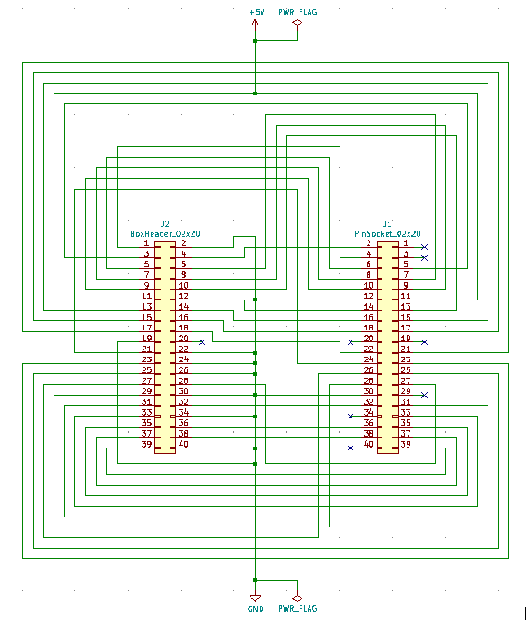
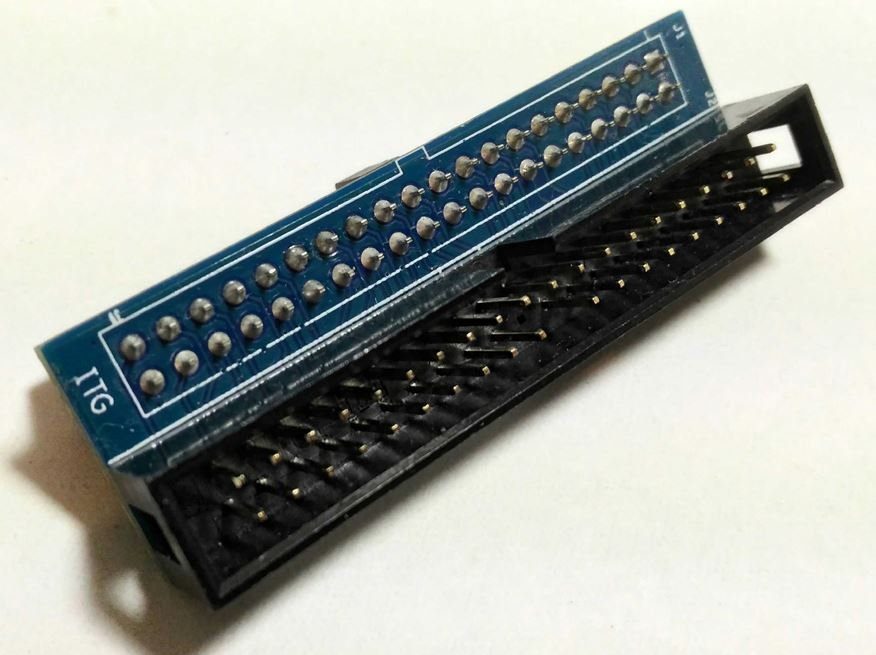
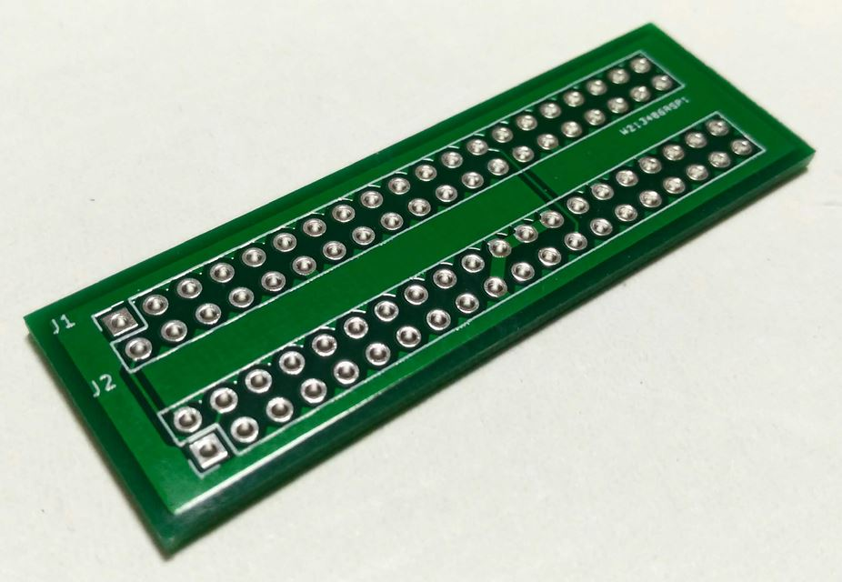
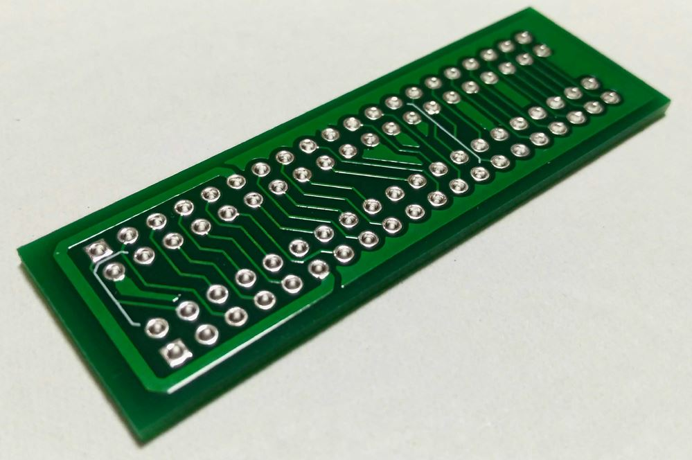
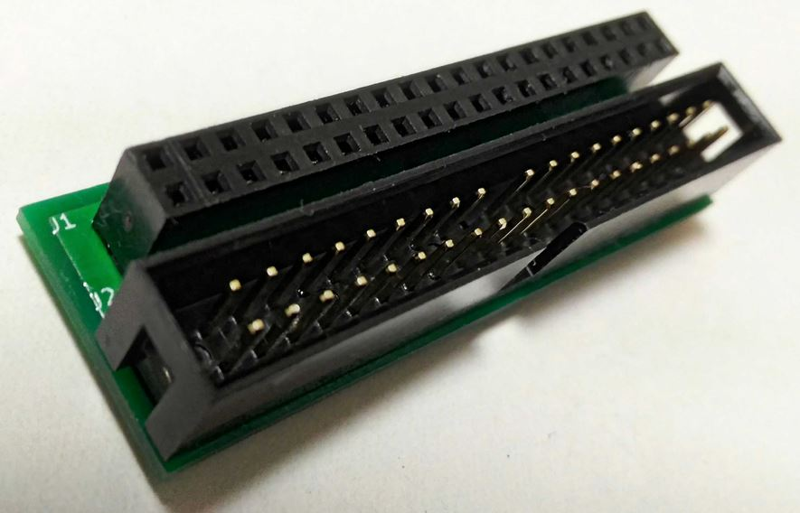
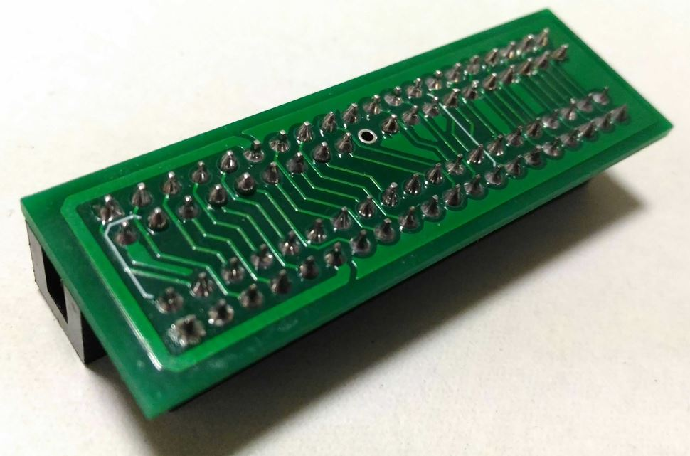
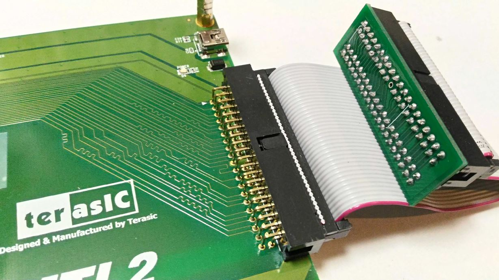
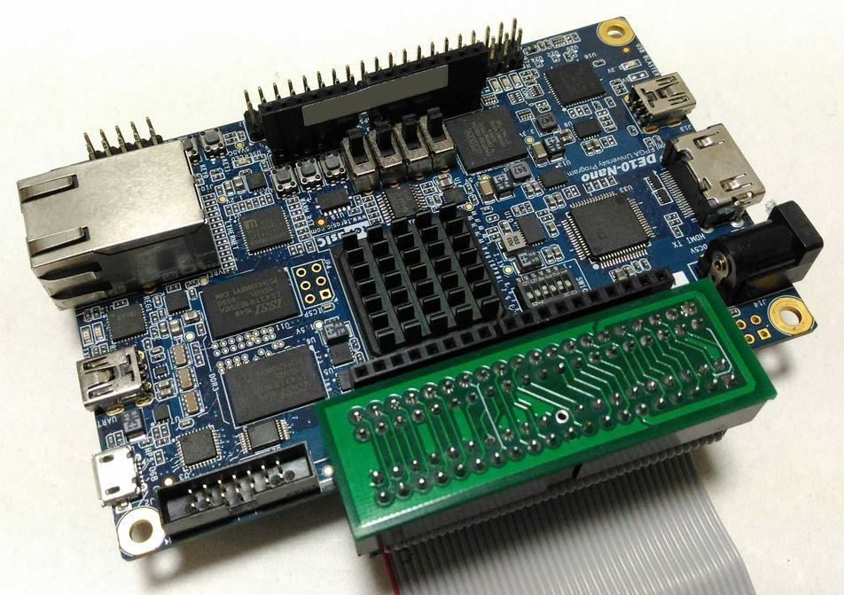
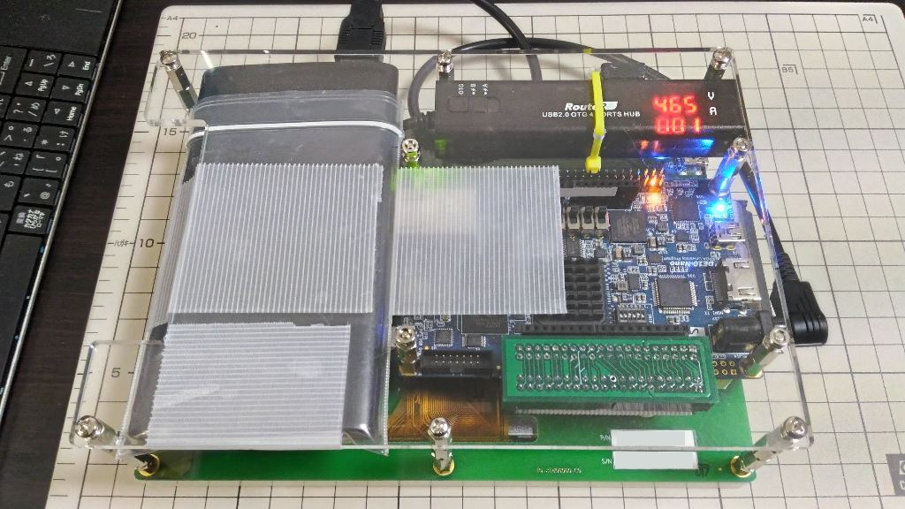

# ITG U-turn Adapter (itg_uturn_adapter)

- KiCad PCB artwork for Terasic MTL2 multi touch display IDE to Terasic FPGA devkit GPIO (ITG) compatible adapter
- Unlike the genuine ITG adapter, ITG U-turn Adapter has a input and a output port on same PCB side.
- Useful to reduce system height and increase stability of the connection
- Verified working with Terasic DE10-Nano and MTL2
- no warranty or guarantee

PCB schematic

Original ITG Adapter

ITG U-turn Adapter front side

ITG U-turn Adapter back side

front side with OST 302-S401 2x20 box pin header and 2x20 generic pin socket mounted
No.20 pin on 2x20 box pin header should be removed for some IDE cable connector

back side with header and socket mounted

connecting to MTL2

connecting to DE10-Nano

Tablet-like composition of MTL2 and DE10-Nano, low-height coupled with ITG U-turn Adapter

